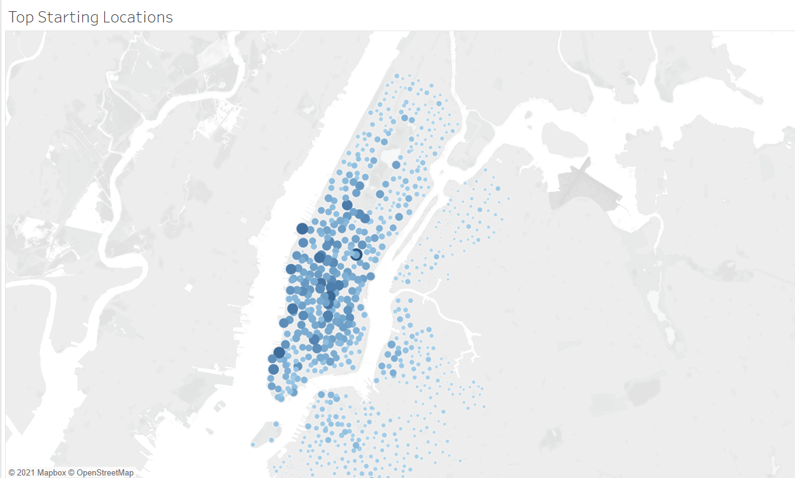
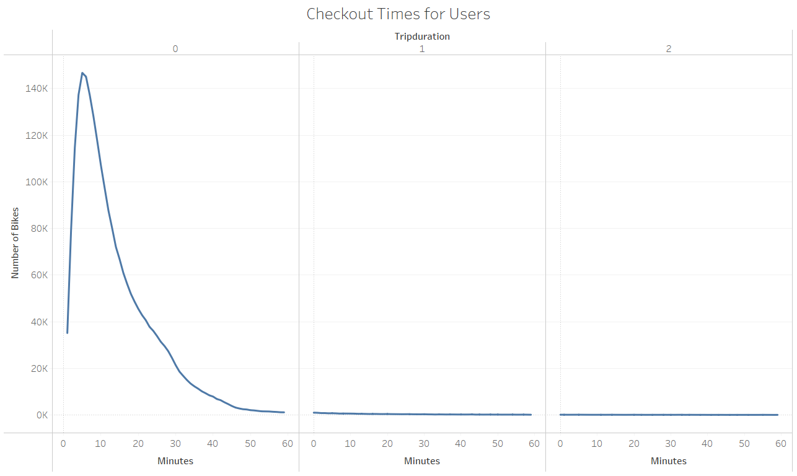
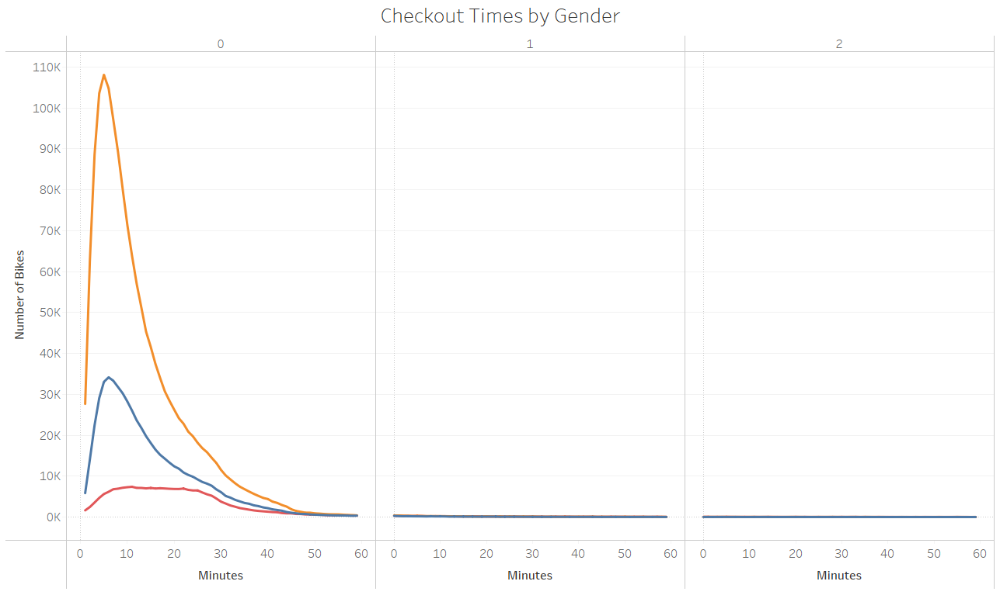
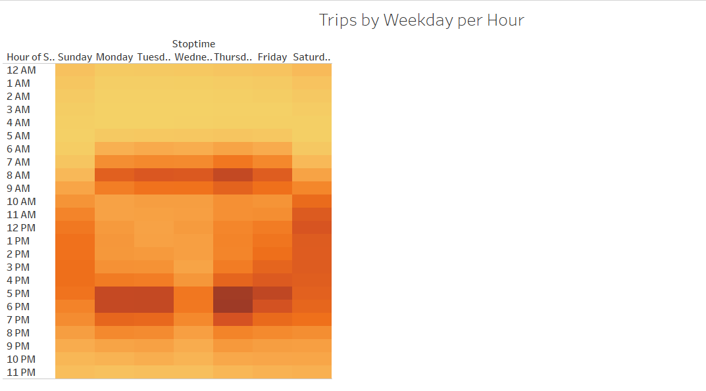
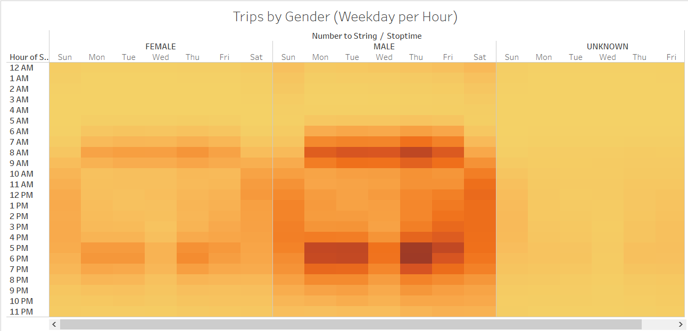
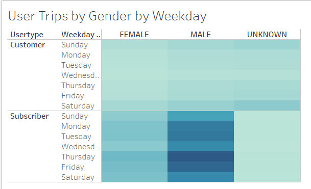

# Bikesharing

## Purpose
The purpose of this analysis is to discover trends in CitiBike usage in New York City. We uncover trends in dates, duration of trips, and how rides differ between genders. To complete our analysis, the data must be reformatted using Pandas before adding it to our visualizations with Tableau.
    The Tableau Story can be found here: [link to story](https://public.tableau.com/profile/drew.piispanen#!/vizhome/NYC_Citibike_Challenge_16200063082500/NYStory?publish=yes)

### Technologies Used
- Tableau
- Jupyter Notebooks
- Python - Pandas

## Results
Between the analysis of the different visualizations, we found the following (follows the Tableau Story): 
#### Top Starting Locations
  - We can clearly see that the lower parts of Manhattan are most useful for the CitiBikes, which should come with little surprise.

#### Bike Repairs
  - Some bikes have a much higher number of trips, which may mean these will require possible repairs in the future. 

#### Trip Durations
  - Checkouts from a trip peak at around 5 minutes, and ride time slowly decreases, until about 1 hour of riding. Rarely any trips last longer than that.

#### Durations Between Genders
  - We can see here that females tend to have slightly longer trips than men, with women peaking at around 6 minutes whereas men peak around 5.

#### Bike Scheduling
  - Mirroring a typical 9-5 M-F work schedule, the bikes tend to go during peak rush hour times. On the weekends, it's more blurred, with any point during the main hours of the day being times to use the bikes.

#### Times Between Genders
  - Not a huge change in relationship between genders, indicating that both genders probably use it for commuting to and from work.

#### User Trips by Gender by Weekday
  - Between user groups, it seems as though subscribers have to have a gender listed - due to the lack of data in that category. Also, unknown genders typically seem to use the bikes on the weekends, as do most of the "Customer" user type.

## Conclusions
Based on our analysis, we can see that CitiBikes are used mostly for commuting. Although there are instances of the bikes being used on the weekends, a majority of trips are used between Monday and Friday, from 9-5. Regardless of gender, the bikes are used during peak commute times. Most commonly, these bikes are used in places where people work the most, which in this case is lower Manhattan.
  
To enhance the effectiveness of the analysis, we could add the following visualizations to our story:
- <b>Trip distance:</b> By adding a calculation that measures the distance between the starting lat/long and the ending lat/long, we could get a better sense of how far people typically go with these bikes.
- <b>Location by ages:</b> To look at different sections of the city, we could break apart certain lat/long coordinates and determine age breakdowns by the different areas. In some places, there are higher prevelance of younger populations and this would help us better market to these areas more effectively.

